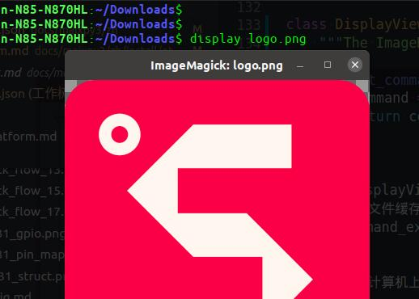

---
title: 如何适配你的平台
keywords: MaixPy, MaixPy3, Python, Python3, MicroPython
desc: maixpy doc: 如何适配你的平台
--- 

> 通过【MaixPy3开发文档】可知基础的 Python3 编译、安装、测试等开发方法。

本文基于 [MaixPy3 项目主页](https://github.com/sipeed/MaixPy3) 详细地介绍了 MaixPy3 项目结构，帮助你更好的适配 MaixPy3 环境。

## 2021 年的 Python 可以彻底跨平台了吗？

答案是还不足够的，仍然有很多依赖底层库差异导致了 Python 模块难以跨平台兼容。

虽然绝大部分软件模块（如：pil、numpy、urllib3）都支持跨平台了，但在嵌入式 linux 设备的 Python 调用硬件资源（如：video \ audio \ nn）的问题上，仍然不能达到理想的跨平台接口。

因此 MaixPy3 是围绕一系列支持边缘 AI 的 Linux 设备来做的，短期内不会考虑所有平台（如 Android & Windows ）。

## 适配 MaixPy3 流程是怎样的？

除去必要 Python3 调取硬件资源的方法，在 MaixPy3 上的开发更像是自上而下的模块接口统一的工作。

所以可以从上层软件往下要求硬件提供相关功能模块的适配。

从用户角度描述常用的功能如下：

- 支持显示器（display）
- 支持摄像头（camera）
- 支持音频录音播放（audio）
- 支持神经网络算法（nn）
- 支持按键、触摸、鼠标、键盘等事件（evdev）
- 支持点灯（gpio）
- 支持上网（network）
- 支持访问 I2C / SPI / UART / USB 等协议外设或传感器

于是适配功能的流程描述如下：

1. 首先在 Linux 系统上提供上述功能模块，可以动（静）态依赖库提供，也可以系统调用提供，~~还可以直接寄存器操作~~。
2. 接着通过更多的 Python3 拓展模块实现相应的功能，此时拥有该模块基础使用的 Python 代码。
3. 最后在 MaixPy3 中统一存在差异的 Python 代码，屏蔽不同设备不同硬件的差异。

## 以适配【显示器】为例

> 由于各个产品的硬件适配程度不同，有些过程可能已经提前完成，你可以选择跳过。

想要使用 Python 在屏幕上显示内容，可以先从上层 Python 代码开始描述功能，为了能够解决基本的图像处理，选择一个 Python 中经典流行通用的 PIL 图像库 [pillow](https://github.com/python-pillow/Pillow)。

现在可以使用代码打开图片并显示到屏幕上了：

```python
from PIL import Image
im = Image.new("RGB", (640, 480), "#FF0000")
im.show()
```

这时候若是从【显示器】的角度设计一个 display 模块，可以写成如下代码：

```python
from PIL import Image
from maix import display
display.show(Image.new("RGB", (640, 480), "#FF0000"))
```

而 `from maix import display` 的实现可以简化成如下代码：

```python
from PIL import Image
display = Image.new("RGB", (640, 480), "#FF0000")

def show(img):
  global display
  if isinstance(img, Image.Image):
    display.paste(img, box)
  display.show()
```

这时候 `display` 模块的角度就是作为显示器模块，实现了同一份代码在不同类型的 Linux 设备之间产生同样的效果。


在达到这样的效果验证后，就可以开始做具体的移植适配。

### 准备 Linux / Python3 / pillow 等基础功能模块

准备一个目标 Linux 平台上的 Python3 解释器，与之配套的还有 目标平台的 GCC 编译链与系统目录（/usr/include & /lib）相关文件。

> 期间经历一系列的目标 Linux 平台的系统移植和编译操作后

在确保 Linux 系统可以运行 Python 解释器后，通过 pip 下载安装 pillow 模块，验证上述 Python 实现的功能后，在 MaixPy3 的 setup.py 中给 `setup()` 函数的 `install_requires` 参数加入 `pillow` 模块。

这时候用户在安装 `pip install MaixPy3` 的时候，由于 MaixPy3 依赖于 pillow 这个模块，如果安装过程中发现系统里没有，就会尝试下载编译安装 pillow 模块，但对于一些不能编译安装模块的 Linux 设备就需要系统里直接内置 pillow 模块，以减少用户的困扰。

### 但运行代码后并没有效果

为什么？

这是因为不同平台的屏幕的显示方式（命令）有所不同，不妨从 pillow 来看看的 show 是如何工作的。

```python
from PIL import Image
im = Image.new("RGB", (640, 480), "#FF0000")
im.show()
```

在这段代码中的 `im.show()` 最终会依赖于 [ImageShow.py](https://github.com/python-pillow/Pillow/blob/master/src/PIL/ImageShow.py) 来完成图像对象的展示。

在 Linux 上是如何工作的呢？

```python

class UnixViewer(Viewer):
    format = "PNG"
    options = {"compress_level": 1}

    def get_command(self, file, **options):
        command = self.get_command_ex(file, **options)[0]
        return f"({command} {quote(file)}; rm -f {quote(file)})&"

    def show_file(self, file, **options):
        """Display given file"""
        fd, path = tempfile.mkstemp()
        with os.fdopen(fd, "w") as f:
            f.write(file)
        with open(path) as f:
            command = self.get_command_ex(file, **options)[0]
            subprocess.Popen(
                ["im=$(cat);" + command + " $im; rm -f $im"], shell=True, stdin=f
            )
        os.remove(path)
        return 1


class DisplayViewer(UnixViewer):
    """The ImageMagick ``display`` command."""

    def get_command_ex(self, file, **options):
        command = executable = "display"
        return command, executable

```

可以看到 DisplayViewer 继承 UnixViewer 对象，在 show_file 的时候将图像文件缓存到临时文件（`tempfile.mkstemp()`），再通过 get_command_ex 调用 display 系统命令（程序）完成图像的显示。

> 简单来说就是【在显示器上显示一张图片】的意思。



那在嵌入式 arm Linux 硬件又会是怎样的呢？

在 v831 的 linux 系统中可以使用和 display 类似的 fbviewer 程序来显示一张图像。

```
root@sipeed:/# fbviewer /home/res/logo.png 
fbv - The Framebuffer Viewer
/home/res/logo.png
140 x 140
```

所以如何注入 fbviewer 的显示接口进 pillow 模块呢？（在 `maix/__init__.py` 中有如下一段代码）

```python
try:
  import shutil
  from PIL import ImageShow
  # use fbviewer on linux
  # os.system('ln -s /usr/sbin/fbviewer /usr/sbin/display')
  if shutil.which("fbviewer"):
    class fbViewer(ImageShow.UnixViewer):
      def get_command_ex(self, file, **options):
        command = executable = "fbviewer"
        return command, executable
    ImageShow.register(fbViewer, 0)
except ModuleNotFoundError as e:
  pass

```

可以看到当发现系统里有 fbviewer 时就会将该类注入到 PIL 的 ImageShow 的显示接口中，又或是在系统里直接将 fbviewer 链接到 display 命令上。

现在已经成功适配到具体的屏幕操作了，但这样就足够了吗？

### 怎样实现会更好？

这样还不够，这样实现仅是完成了功能。

简单分析以上上述实现，其性能损耗主要发生在当图像对象进入 pillow show_file 的时候需要对其编码保存到某个临时文件（/tmp）中，然后再交给 fbviewer 去打开文件，fbviewer 对其解码后再写到 framebuffer 的设备（/dev/fb0）上。

问：为什么不把图像的 rgb 数组直接写到 fb 上呢？

答：没错，内部的 _maix_display 拓展模块实现亦如此。

```c++
PyDoc_STRVAR(Display_draw_doc, "draw()\nDraw image(rgb888) bytes data to lcd.\n");
static PyObject *Display_draw(V831DisplayObject *self, PyObject *args)
{
    PyObject *img_bytes = NULL;
    int img_width = 0, img_height = 0;
    if (!PyArg_ParseTuple(args, "Oii", &img_bytes, &img_width, &img_height))
    {
        return NULL;
    }
    if (NULL != self->disp) {
      if (self->disp->width >= img_width && self->disp->height >= img_height) {
          uint8_t *rgb_data = (uint8_t *)PyBytes_AS_STRING(img_bytes);
          if (rgb_data != NULL) {
            self->disp->draw(self->disp, rgb_data, (self->disp->width - img_width) / 2,(self->disp->height - img_height) / 2, img_width, img_height, 1);
          }
      }
    }
    Py_RETURN_NONE;
}
```

```python
from _maix_display import V831Display
__fastview__ = V831Display(__width__, __height__)
__fastview__.draw(img.tobytes(), __fastview__.width, __fastview__.height)
```

这就是【屏幕清屏（变黑） `dd if=/dev/zero of=/dev/fb0` 】与【显示黑色图片 `display black.bmp` 】之间存在的性能差距。

至此【显示器】基本适配完成了，其他模块亦如此，但不一定每个模块都要使用这样方式进行移植，只是出于性能的考虑可以这样做。

> 可以自行查阅 Linux framebuffer 相关资料了解更多。

### 以 Maix 包为公共入口

做完上述功能后，就要回到这里思考一个用户体验的问题（开发者也可以是用户）。

如何让同一份代码在不同平台表现一致，减少用户的再次学习成本和认知成本，所以制作了一个 maix 入口模块，以减少重复实现的功能代码。

> 若是不使用某个模块（maix）去约束入口代码，就会产生代码碎片化，就如同你所看到的 Linux 上各种 Python 功能模块，做同一件事，不同平台上的接口与用法都不尽相同，但你需要花费不少时间去寻找并使用，为什么不能统一常用的功能接口呢，答案肯定是可以的，但这可能需要一些时间。

从摄像头获取一张图片并显示出来这样的功能，只需要使用如下代码就可以实现这个功能，并且它在大多数平台上都是可以做到的。

```python
from maix import display, camera
display.show(camera.capture())
```

像 MaixPy3 在设计 display 和 camera 模块的时候都尽可能围绕则 pillow 和 python-opencv 模块的接口设计衍生而来的。

包括后来加入的 i2c \ spi \ pwm \ gpio 亦如此。

但也有一些例外，如音频驱动设备存在 alsa 和 tinyalsa 两类接口，需要从源头上去完成 Python 拓展模块的编写，而人工智能 NN 模块的实现更是千奇百怪，难以统一。

所以我们可以通过 maix 模块作为入口，重新围绕功能来抽象设计接口。

这样在不同平台上只需要链接不同的 Python 依赖模块即可，如 v831 链接的是 _maix_camera 模块，而 pc 上直接使用 opencv-python 模块，当然也可以是任意调用其他模块，不一定是 MaixPy3 所提供的参考模块，这取决于你的想法。

## 附录（一）：通用软件模块和经过优化的模块有什么不同？

通用软件的操作接口大多都是通过 shell 接口调用系统程序完成的功能，所以在执行性能上有很大的损失。

所谓经过优化实际上只是通过内置代码模块的方式进行操作的，这样就减少了不必要的数据交换了。

那么执行性能究竟差在哪里？除了上述说的【显示器】适配时的优化，下面再以 GPIO 的实现为例说明这个问题。

待更

