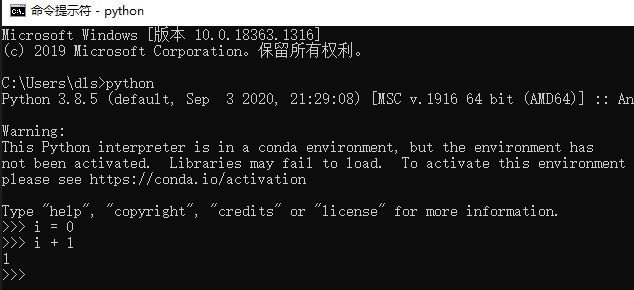

> 本文不描述具体的安装过程，只交待有哪些用途和开发方法。

## 什么是 jupyter ?

**Jupyter Notebooks 是数据科学/机器学习社区内一款非常流行的工具。**

Jupyter Notebook 是基于网页的用于交互计算的应用程序。其可被应用于全过程计算：开发、文档编写、运行代码和展示结果。——[Jupyter Notebook 官方介绍](https://jupyter.org/)

简而言之，Jupyter Notebook 是以网页的形式打开，可以在网页页面中直接编写代码和运行代码，代码的运行结果也会直接在代码块下显示。如在编程过程中需要编写说明文档，可在同一个页面中直接编写，便于作及时的说明和解释。

## 有什么用？

它可以作为 MaixPy3 的开发环境，代码运行结果在文档记录下来，提供给其他人的时候所见即所得。

例如：[examples/usage_display.ipynb](https://github.com/sipeed/rpyc_ikernel/blob/master/examples/usage_display.ipynb)

> 更多案例可见 Python Code 的官方示例文档 [examples/Notebook/Running_Code.ipynb](https://nbviewer.jupyter.org/github/jupyter/notebook/blob/master/docs/source/examples/Notebook/Running%20Code.ipynb)

## 怎么进行 Python 编程？

在 Windows 上安装 Anaconda 软件即可完整安装（有清华源加速），安装了 jupyter 服务后，通过 jupyter notebook 或 jupyter lab 启动编辑器。

> 注意，它本身是 Web 服务，而不是本地应用，所以会通过浏览器打开。

运行 jupyter notebook 后会启动默认浏览器进入主界面，可以看到有一些文件目录，这些文件存放于 jupyter 服务的目录下。

所见即所得的编辑器，可以看到文档和代码的运行结果直观的展示出来。

使用方法细节请参考 [jupyter 官方使用文档](https://jupyter-notebook.readthedocs.io/en/stable/ui_components.html) 。

#### 什么是 jupyter kernel ？

jupyter 可以在文档中运行很多代码，但为什么能运行代码取决于目标内核，如内置的 Python 内核，点击右上角的 new 新建文件的时候就可以创建一个指定执行内核的 jupyter notebook 文件。

这时候就可以得到一个启动 Python 内核的 notebook 文档了。

> 同理运行其他语言，也只需要更换相应的内核即可。

### 本机执行 Python 代码

接着上述说明，选择了内置的 Python3 内核就可以在文档中运行一些 Python code ，使用效果如下：

这种方式的文档并不存在本地，需要在硬件中部署 jupyter 和 ipython 的程序，常见于 PC / 服务器 / 树莓派等内存大于 512M 的设备，运行代码有如下效果。

> 执行流程为 notebook 文档中的 Python 代码传递到本机的 jupyter kernel 中被解释执行。

### 远端执行 Python 代码

和本机执行 Python 代码不同的是内存需求不同，当嵌入式 Linux 设备内存低于 128M 的时候启动 jupyter 服务对 Linux 系统来说是一种负担，更不用说后续的开发过程中的内存消耗了。

所以 MaixPy3 为嵌入式设备通过 [rpyc_ikernel](https://github.com/sipeed/rpyc_ikernel) 项目会为本机的 jupyter 提供一个可以远程调用（rpc）的内核。

> 安装方法在此 [rpyc_ikernel](https://github.com/sipeed/rpyc_ikernel) ，请查收。

在没有这个内核的时候，只能通过终端命令行交互来完成代码的调用，属于较为原始的开发方式。

在有了这个内核后，用户可以通过 jupyter notebook 中选择 rpyc 的内核，从而实现本机文档中的 Python 代码提交到远端（远程）机器执行代码，并能够将图像显示到本机的文档中，尤其是支持图像传输。

这需要在目标机器上也同样启动 rpyc 服务（MaixPy3 内置），且该服务比 jupyter kernel 服务在内存占用要更更小，如在 V831 64M 内存的芯片上启动会消耗 11M 内存，而启动 jupyter 至少需要 48M 内存。

> 从长远的开发内容来看，使用 jupyter notebook 可以保留每次的运行结果以及向别人更好的讲解代码的过程，并且交互式的运行程序有利于更快的调试某些操作，而不用重新开始运行 python 程序，但坏处就是使用久了系统性能会下降，以至于无法忍受而重启系统。

## jupyter 带来了什么？

在没有 notebook 之前，在IT领域工作的我都是这样工作的：在普通的 Python shell 或者在 IDE （集成开发环境）如 Pycharm 中写代码，然后在 word 中写文档来说明你的项目。这个过程很反锁，通常是写完代码，再写文档的时候我还的重头回顾一遍代码。最蛋疼的地方在于，有些数据分析的中间结果，我还的重新跑代码，然后把结果弄到文档里给客户看。有了 notebook 之后，我的世界突然美好了许多，因为 notebook 可以直接在代码旁写出叙述性文档，而不是另外编写单独的文档。也就是它可以能将代码、文档等这一切集中到一处，让用户一目了然。

> 源自：[jupyter notebook 可以做哪些事情？](https://www.zhihu.com/question/46309360/answer/254638807)
