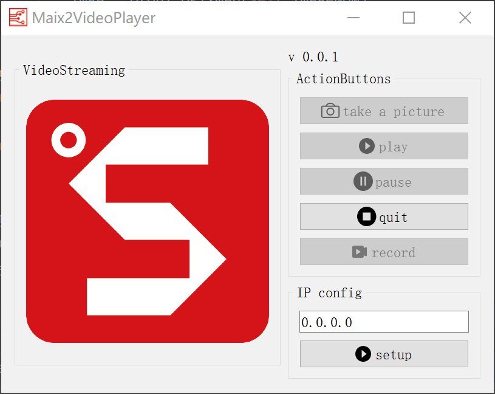
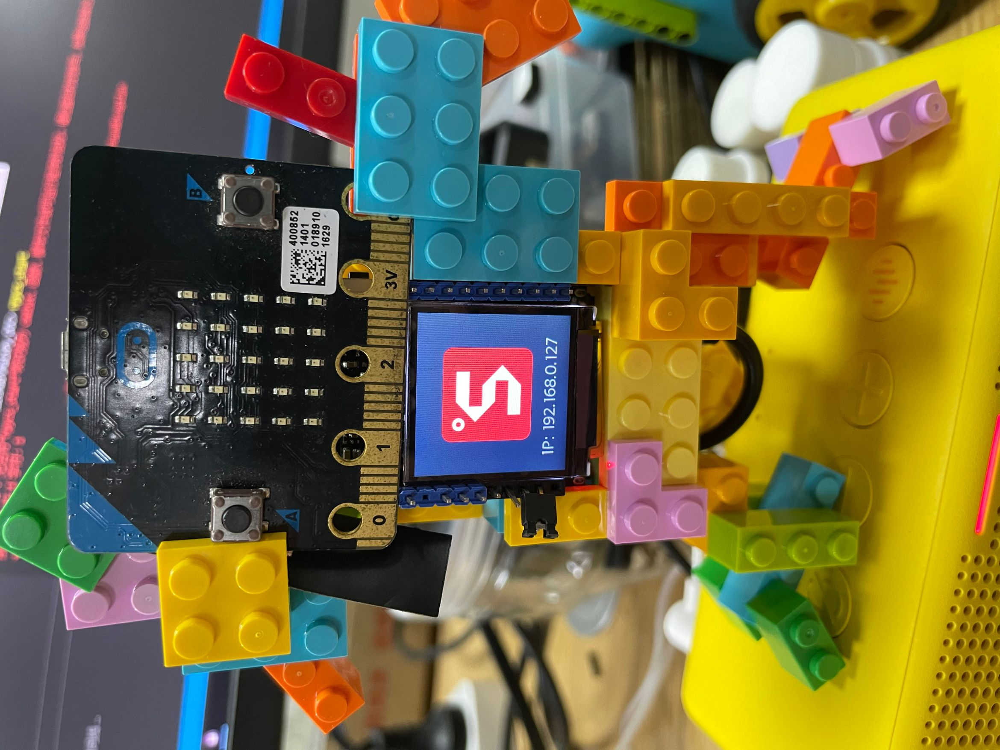

> 这是一个图传客户端工具，脱离 jupyter 的编程环境，使用的时候只需要在电脑上安装好就可以链接到硬件中获取图传信息。


这个工具是通过 Python 实现的 rtsp + rtp 流媒体服务，支持文件、图像、显示器、摄像头的图像传输，适用于支持 Python3 的系统。

## 安装方法

首先知道它是一个 C/S 结构图传客户端，你需要在某个硬件上安装 maixpy3 和启动服务，与之对应的客户端访问该硬件获取它的流媒体，这个硬件可以是你的嵌入式 linux 设备，也可以是你的 linux 计算机。

### 服务端配置过程

在 linux 设备上安装 maixpy3 执行 maixpy3_rpycs 即可启动作为服务端。

```bash
(venv) $ pip3 install maixpy3
(venv) $ maixpy3_rpycs
```

### 客户端配置过程

接着要在其他电脑上通过 Python 安装 [rtsp_pyqt](https://github.com/sipeed/MaixPy3/tree/main/examples/rtsp_pyqt) 客户端工具。

```bash
(venv) $ pip3 install -r requirements.txt
(venv) $ python3 mainLogic.py
```

### 使用方法

运行后可见下图，然后输入 IP （如：192.168.0.127）进行链接：



按下【setup】链接到目标设备自动获取摄像头流，支持播放、暂停等操作，拍照和录像自动保存到目录下的文件夹。

## 多余的讯息

> 如 IP 可以这样获取，我只是想炫耀一下我的拼装技术，逃~



